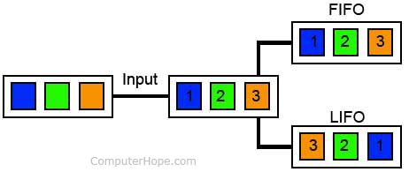

# FIFO-LIFO

Simulação de funcionamento dos algorítmos FIFO e LIFO no funcionamento dos sistemas operacionais.

Em determinadas aplicações, as pilhas e filas representam estruturas de dados importantes, nas quais seus elementos são organizados em função dos critérios definidos pelo programador.

Exemplo FIFO(First In First Out) e LIFO(Last In First Out)

